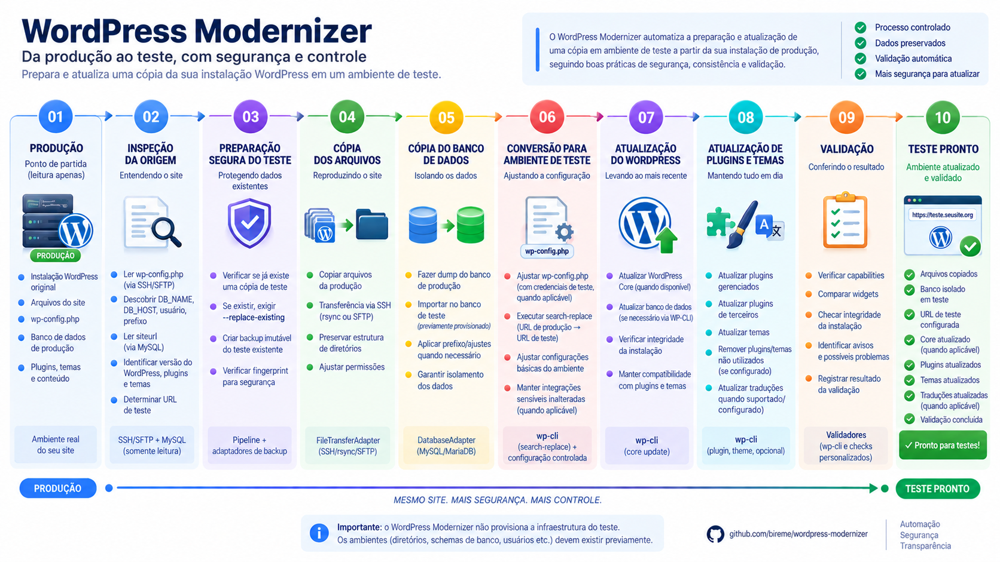

# wp-modernizer

O `wp-modernizer` prepara, migra, atualiza e valida cópias de
instalações WordPress em ambiente de **TESTE**, preservando o estado
da execução em caso de falha.

> **Este projeto nunca implanta em PRODUÇÃO.**

## Visão geral



O fluxo segue o princípio de falha com preservação:

```text
PRODUÇÃO
   |
   | leitura da origem
   v
cópia de TESTE
   |
   +--> migração
   |
   +--> atualização
   |
   +--> validação
            |
            +--> sucesso
            |
            +--> falha
                   |
                   +--> parar
                   +--> preservar estado
                   +--> correção manual
                   +--> resume
```

> **O wp-modernizer nunca implanta em PRODUÇÃO.**
>
> O modelo de domínio rejeita destinos de produção e a aplicação não oferece comandos para promover, sincronizar, publicar ou implantar uma instalação de TESTE em PRODUÇÃO.

## Principais características

* migração de instalações WordPress de PRODUÇÃO para TESTE;
* descoberta controlada das informações da instalação de origem;
* cópia de arquivos e banco de dados;
* atualização da instalação de TESTE;
* planejamento antes da execução;
* modo `--dry-run`;
* validação por capacidades;
* checkpoints entre etapas;
* preservação do estado em caso de falha;
* retomada com `resume`;
* proteção contra operações destrutivas em caminhos não autorizados;
* backup da cópia de TESTE antes de substituí-la;
* suporte a SSH por chave ou senha;
* credenciais sensíveis mantidas fora dos logs e do estado persistido;
* arquitetura baseada em portas e adaptadores;
* testes unitários independentes de WordPress, MySQL, SSH e WP-CLI.

---

## Requisitos

### Python

O projeto requer:

```text
Python >= 3.10
```

### Ambiente operacional

Para execuções reais, o servidor operacional/de TESTE precisa disponibilizar a infraestrutura necessária às operações que serão executadas, incluindo, conforme o caso:

* PHP CLI;
* WP-CLI;
* cliente MySQL;
* acesso aos bancos de TESTE;
* SSH/rsync para autenticação por chave; ou
* SSH/SFTP via Paramiko para autenticação por senha;
* acesso de leitura à instalação WordPress de origem;
* acesso de escrita à instalação de TESTE;
* diretório persistente e gravável para o estado do modernizer.

WordPress, MySQL, SSH, PHP e WP-CLI **não são necessários para executar os testes unitários** do projeto.

---

## Instalação

Clone o repositório:

```bash
git clone https://github.com/bireme/wordpress-modernizer.git
cd wordpress-modernizer
```

Crie um ambiente virtual:

```bash
python -m venv .venv
```

Ative-o:

```bash
. .venv/bin/activate
```

Instale o projeto com as dependências de desenvolvimento:

```bash
python -m pip install -e '.[dev]'
```

O comando principal ficará disponível como:

```bash
wp-modernizer
```

---

## Configuração inicial

Crie a configuração local a partir do exemplo:

```bash
cp config.example.yaml config.yaml
```

O `config.yaml` contém informações específicas do ambiente e do servidor e **não deve ser versionado**.

Valores secretos não devem ser gravados diretamente no YAML. O arquivo de configuração utiliza referências a variáveis de ambiente, resolvidas pelo `EnvironmentSecretProvider`.

Exemplo conceitual:

```yaml
servers:
  source-example:
    host: source.example.org
    port: 22
    environment: production
    username_secret: PROD_EXAMPLE_USERNAME
    authentication: password
    password_secret: PROD_EXAMPLE_PASSWORD
    host_key_policy: strict
```

Os valores reais são fornecidos pelo ambiente:

```bash
export PROD_EXAMPLE_USERNAME='usuario'
export PROD_EXAMPLE_PASSWORD='senha'
```

Consulte [`docs/configuration.md`](docs/configuration.md) para a estrutura completa da configuração.

---

## `config.yaml` e `plugins.yaml`

Os dois arquivos possuem responsabilidades diferentes.

### `config.yaml`

É local e específico do servidor.

Pode conter:

* instalações;
* servidores;
* caminhos permitidos;
* endpoints de bancos de TESTE;
* aliases e overrides;
* referências a secrets;
* diretório de estado;
* opções específicas da infraestrutura.

Ele não deve ser versionado.

### `plugins.yaml`

Contém a lista pública e compartilhada de plugins gerenciados pelo modernizer.

Esse arquivo:

* acompanha a aplicação;
* é versionado;
* possui localização fixa;
* é carregado automaticamente;
* não pode ter seu caminho substituído por argumento de linha de comando, variável de ambiente ou configuração YAML.

Cada plugin gerenciado é validado antes da execução.

---

## Conceitos de segurança

### PRODUÇÃO é somente origem

Uma instalação configurada como PRODUÇÃO pode ser utilizada como fonte para leitura e migração.

O modernizer não executa sobre ela:

* atualização WordPress;
* escrita de banco;
* WP-CLI remoto;
* PHP remoto;
* publicação;
* sincronização reversa;
* implantação.

A inspeção da origem lê diretamente o `wp-config.php` através do transporte remoto autorizado e extrai os valores necessários sem executar o WordPress.

### TESTE é o único destino mutável

Endpoints configurados em `databases:` precisam representar ambientes de TESTE.

`allowed_database_endpoints` funciona como uma allowlist destrutiva e também aceita somente endpoints de TESTE.

### Segredos da origem são efêmeros

Os valores:

```text
DB_USER
DB_PASSWORD
```

da instalação de PRODUÇÃO não são persistidos em:

* logs;
* exceções;
* estado;
* manifestos;
* recovery data;
* argumentos de subprocessos.

Quando o cliente MySQL precisa utilizá-los, eles são fornecidos por arquivo temporário protegido e removido depois da operação.

---

## Fluxo recomendado

Para uma instalação chamada `example-site`, o fluxo operacional recomendado é:

```text
inventory
    |
diagnose
    |
plan
    |
pipeline --dry-run
    |
revisão
    |
pipeline
```

### 1. Inspecionar a instalação

```bash
wp-modernizer --config config.yaml inventory example-site
```

`inventory` coleta informações disponíveis da instalação.

Campos independentes são analisados individualmente; a indisponibilidade de uma informação não precisa interromper toda a coleta.

### 2. Diagnosticar capacidades

```bash
wp-modernizer --config config.yaml diagnose example-site
```

`diagnose` verifica capacidades e integridade do ambiente.

Isso ajuda a identificar antecipadamente problemas como ausência de PHP, WP-CLI ou outros recursos necessários.

### 3. Gerar o plano

```bash
wp-modernizer --config config.yaml plan example-site
```

Para obter saída estruturada:

```bash
wp-modernizer --config config.yaml plan example-site --json
```

`plan` mostra o que o modernizer pretende executar sem alterar a instalação.

O planejamento inclui, conforme aplicável:

* etapas;
* dependências;
* pontos de controle;
* banco de origem;
* banco de destino;
* URLs;
* caminhos;
* exclusões de cópia;
* trabalho pendente;
* resolução de instalações aninhadas.

### 4. Validar com dry-run

```bash
wp-modernizer --config config.yaml pipeline example-site --dry-run
```

O `--dry-run` garante que o destino não seja alterado.

Ele não significa simplesmente adicionar `--dry-run` aos comandos externos. Cada operação do modernizer possui uma classificação explícita de segurança.

### 5. Executar

Depois de revisar o inventário, diagnóstico, plano e dry-run:

```bash
wp-modernizer --config config.yaml pipeline example-site
```

---

## Comandos

| Comando     | Finalidade                                         | Altera TESTE? |
| ----------- | -------------------------------------------------- | ------------: |
| `inventory` | Coleta informações da instalação                   |           Não |
| `diagnose`  | Verifica capacidades e integridade                 |           Não |
| `plan`      | Calcula e apresenta o plano                        |           Não |
| `migrate`   | Prepara arquivos e banco da cópia de TESTE         |           Sim |
| `update`    | Executa as etapas de atualização da cópia de TESTE |           Sim |
| `pipeline`  | Executa migração + atualização                     |           Sim |
| `resume`    | Retoma uma execução interrompida                   |           Sim |

Todos os comandos aceitam saída JSON quando aplicável:

```bash
wp-modernizer --config config.yaml inventory example-site --json
```

---

## `--dry-run`

O dry-run é uma proteção global.

Exemplo:

```bash
wp-modernizer --config config.yaml pipeline example-site --dry-run
```

Durante a simulação, cada etapa é classificada de acordo com sua capacidade.

### `READ_ONLY`

A operação pode ser executada porque não altera estado.

Resultado:

```text
VALIDATED
```

### `MUTABLE_WITHOUT_SAFE_DRY_RUN`

A operação seria mutável, mas não possui uma simulação considerada segura.

Ela **não é executada**.

Resultado:

```text
PLANNED
```

### `MUTABLE_WITH_NATIVE_DRY_RUN`

A operação possui uma forma de validação nativa explicitamente revisada e autorizada.

Resultado:

```text
VALIDATED
```

Uma opção chamada `--dry-run` em uma ferramenta externa não é suficiente para o modernizer considerá-la segura automaticamente.

Cada operação precisa ser explicitamente classificada.

Uma execução real bem-sucedida fica:

```text
EXECUTED
```

---

## Migração

O comando:

```bash
wp-modernizer --config config.yaml migrate example-site
```

prepara a cópia de TESTE.

O fluxo pode incluir:

* inspeção da origem;
* descoberta do banco;
* resolução do banco de TESTE;
* backup de uma cópia de TESTE existente;
* transferência de arquivos;
* dump da origem;
* importação no destino;
* substituições necessárias para o ambiente de TESTE;
* checkpoints entre etapas.

---

## Substituição de uma instalação de TESTE existente

Uma instalação já existente não é substituída implicitamente.

Sem autorização explícita, a operação é recusada.

Para permitir a substituição:

```bash
wp-modernizer --config config.yaml migrate example-site --replace-existing
```

ou, no fluxo completo:

```bash
wp-modernizer --config config.yaml pipeline example-site --replace-existing
```

Antes de remover a instalação existente, o modernizer precisa criar e validar um backup dela.

O backup fica fora do `htdocs`:

```text
<app_root>/.wp-modernizer-backups/<run-id>/<installation-id>/
```

O snapshot:

* utiliza um caminho novo para cada execução;
* não sobrescreve backups anteriores;
* preserva os dados necessários;
* tem seu conteúdo verificado;
* torna-se somente leitura;
* é revalidado antes da substituição destrutiva.

A instalação existente só pode ser removida depois que o backup for considerado válido.

---

## Bancos de dados

### Descoberta da origem

O banco de PRODUÇÃO não precisa ser cadastrado em `databases:`.

O modernizer descobre diretamente no `wp-config.php` remoto:

```text
DB_NAME
DB_HOST
DB_USER
DB_PASSWORD
$table_prefix
```

Depois consulta `siteurl` diretamente no banco da origem através de uma operação de leitura.

A conta MySQL utilizada em PRODUÇÃO deve ser somente leitura.

### Porta MySQL

Quando `DB_HOST` não informa uma porta explícita, o modernizer tenta:

```text
6612
```

e somente em caso de indisponibilidade do endpoint tenta:

```text
3306
```

Falhas como autenticação negada ou schema inexistente interrompem a descoberta em vez de provocar fallback silencioso.

### Banco de destino

Os bancos cadastrados em:

```yaml
databases:
```

são exclusivamente endpoints controlados de TESTE.

O modernizer não cria bancos automaticamente.

Schemas precisam ser provisionados previamente pela infraestrutura.

---

## Resolução automática do banco de TESTE

Quando o banco de origem possui exatamente o formato:

```text
wp_<name>_prod
```

o modernizer considera como candidato:

```text
wp_<name>_tst
```

A comparação é exata.

Não existe busca por similaridade.

Quando necessário, a instalação pode utilizar:

```yaml
database_override:
```

ou aliases explicitamente configurados.

Ausência ou ambiguidade interrompe a operação para correção pela infraestrutura.

---

## Caminhos e domínio

O domínio é inferido individualmente a partir de `source_path`, relativamente a uma entrada de `allowed_app_roots`.

Exemplo:

```text
allowed_app_root:
    /home/apps

source_path:
    /home/apps/example.org/wp-example/htdocs
```

resulta no domínio:

```text
example.org
```

`destination_path` é opcional.

Quando omitido, o modernizer utiliza o mesmo caminho da origem no servidor operacional de TESTE.

Um caminho explícito pode ser configurado para instalações excepcionais.

---

## URL de TESTE

A URL de TESTE é derivada do domínio inferido.

Exemplos:

```text
https://boletin.bireme.org
```

torna-se:

```text
https://boletin.teste.bireme.org
```

Enquanto:

```text
https://bireme.org
```

torna-se:

```text
https://teste.bireme.org
```

O path da URL é preservado.

Uma instalação excepcional pode utilizar:

```yaml
test_url:
```

O valor explícito tem precedência, mas não pode reutilizar o hostname de PRODUÇÃO.

---

## Atualização

O comando:

```bash
wp-modernizer --config config.yaml update example-site
```

executa as etapas de atualização definidas pelo pipeline para a cópia de TESTE.

O comando não deve ser executado diretamente em uma instalação de PRODUÇÃO.

Para verificar previamente o comportamento planejado:

```bash
wp-modernizer --config config.yaml update example-site --dry-run
```

> A sequência exata de operações WordPress executadas pelo pipeline deve permanecer documentada e testada no código e em [`docs/operations.md`](docs/operations.md), especialmente quando novas operações de atualização forem adicionadas.

---

## Pipeline

O comando mais comum para uma execução completa é:

```bash
wp-modernizer --config config.yaml pipeline example-site
```

Ele concatena:

```text
migração
   +
atualização
```

e preserva os checkpoints necessários para recuperação.

Antes da primeira execução real, recomenda-se:

```bash
wp-modernizer --config config.yaml pipeline example-site --dry-run
```

---

## Falhas e recuperação

O modernizer adota o princípio de:

```text
falhar -> parar -> preservar -> investigar -> corrigir -> retomar
```

Uma falha **não provoca rollback automático**.

Isso é intencional.

Quando uma etapa falha, a instalação de TESTE permanece disponível para investigação.

O estado externo registra informações como:

* última etapa bem-sucedida;
* etapa que falhou;
* detalhes fatais sanitizados;
* checkpoints;
* operações pendentes;
* integridade antes e depois;
* diferenças relevantes;
* fingerprint da instalação.

Depois da investigação e eventual correção manual, a execução pode ser retomada com:

```bash
wp-modernizer --config config.yaml resume example-site
```

O `resume` não continua cegamente.

Ele compara a instalação atual com o estado registrado e exige consistência antes de continuar.

Uma alteração manual é detectada e precisa ser revisada; ela não é aceita silenciosamente.

Consulte [`docs/recovery.md`](docs/recovery.md) antes de restaurar backups ou manipular manualmente uma execução interrompida.

---

## Diretório de estado

`state_directory` é parte essencial do mecanismo de preservação e `resume`.

Antes de uma operação mutável, o modernizer verifica se consegue:

```text
criar
escrever
ler
```

o diretório de estado.

Se isso falhar, a operação mutável é recusada antes de modificar o destino.

### Containers

Quando o modernizer é executado em container, `state_directory` deve ficar em um **volume persistente**.

Não utilize apenas o filesystem efêmero do container.

Caso contrário, a recriação do container pode eliminar os manifestos e checkpoints necessários à recuperação.

---

## Transporte SSH

Cada servidor escolhe explicitamente seu método de autenticação.

### Senha

```yaml
authentication: password
```

Utiliza SSH/SFTP através do Paramiko.

Usuário e senha são obtidos somente no momento da conexão.

### Chave SSH

```yaml
authentication: key
```

Utiliza OpenSSH/rsync.

### Host keys

Em ambientes reais recomenda-se:

```yaml
host_key_policy: strict
```

Nesse modo, chaves desconhecidas ou alteradas são rejeitadas.

Também é possível indicar um arquivo adicional:

```yaml
known_hosts_file: /etc/wp-modernizer/known_hosts
```

Esse arquivo deve ser provisionado previamente por um canal confiável.

---

## Instalações aninhadas

O planner trata instalações pai/filho explicitamente.

Quando uma instalação contém outra instalação WordPress em sua árvore, as exclusões de cópia são calculadas de forma determinística para impedir que o fluxo do pai substitua indevidamente o filho.

Cada instalação continua sendo processada por suas próprias etapas.

---

## Arquitetura

O projeto segue uma arquitetura de **portas e adaptadores**.

Estrutura conceitual:

```text
src/wp_modernizer/
├── domain/
├── application/
├── pipeline/
├── infrastructure/
└── cli/
```

### `domain`

Contém:

* modelos;
* enums;
* invariantes;
* análise de caminhos;
* nomenclatura;
* planejamento.

Não depende de APIs de processos externos.

### `application`

Contém:

* casos de uso;
* portas definidas por `Protocol`.

### `pipeline`

Contém:

* etapas independentes;
* executor;
* checkpoints;
* preservação de estado.

### `infrastructure`

Contém os adaptadores concretos para:

* subprocessos;
* filesystem;
* estado;
* YAML;
* variáveis de ambiente;
* MySQL;
* SSH;
* SFTP;
* rsync;
* WP-CLI;
* Git.

### `cli`

É responsável pela composição da aplicação.

As dependências apontam para dentro, permitindo testar as regras de domínio e segurança com objetos falsos sem exigir infraestrutura WordPress real.

---

## Desenvolvimento

Instale as dependências:

```bash
python -m pip install -e '.[dev]'
```

### Testes

```bash
pytest
```

Os testes marcados como integração são excluídos da execução padrão.

Eles dependem de infraestrutura externa configurada explicitamente.

### Cobertura

A configuração do projeto exige cobertura mínima de:

```text
80%
```

### Ruff

Verifique o código:

```bash
ruff check .
```

Verifique formatação:

```bash
ruff format --check .
```

### Mypy

Execute a análise estática:

```bash
mypy src
```

O projeto utiliza configuração `strict`.

### Verificação recomendada antes de commit

```bash
pytest
ruff check .
ruff format --check .
mypy src
```

---

## Início rápido

Para um ambiente já configurado:

```bash
python -m venv .venv
. .venv/bin/activate

python -m pip install -e '.[dev]'

cp config.example.yaml config.yaml
```

Configure os secrets necessários e então:

```bash
wp-modernizer --config config.yaml inventory example-site
wp-modernizer --config config.yaml diagnose example-site
wp-modernizer --config config.yaml plan example-site
wp-modernizer --config config.yaml pipeline example-site --dry-run
```

Depois de revisar o resultado:

```bash
wp-modernizer --config config.yaml pipeline example-site
```

Se uma execução falhar:

```text
investigue a cópia preservada
        |
corrija o problema
        |
revise o estado
        |
execute resume
```

```bash
wp-modernizer --config config.yaml resume example-site
```

---

## Documentação

A documentação detalhada está separada por responsabilidade.

### [Configuração](docs/configuration.md)

Detalha:

* `config.yaml`;
* `plugins.yaml`;
* servidores;
* secrets;
* bancos;
* URLs;
* caminhos;
* autenticação SSH;
* `state_directory`.

### [Operações](docs/operations.md)

Detalha:

* comandos;
* pipeline;
* capacidades;
* dry-run;
* migração;
* resolução de banco;
* execução.

### [Recuperação](docs/recovery.md)

Detalha:

* preservação em caso de falha;
* checkpoints;
* backups;
* manifestos;
* fingerprints;
* `resume`;
* recuperação manual.

### [Arquitetura](docs/architecture.md)

Detalha:

* domínio;
* aplicação;
* pipeline;
* infraestrutura;
* portas;
* adaptadores;
* composition root;
* separação das responsabilidades.

---

## Princípios operacionais

O comportamento do projeto pode ser resumido por estas regras:

```text
PRODUÇÃO é origem, nunca destino.

TESTE é o único ambiente mutável.

Planejar antes de alterar.

Dry-run nunca deve alterar o destino.

Falhar significa preservar, não esconder a falha com rollback automático.

Uma operação destrutiva exige evidência e autorização explícitas.

Segredos não pertencem ao estado nem aos logs.

Resume valida o estado antes de continuar.
```

---

## Licença

A seleção da licença do projeto ainda depende de aprovação organizacional.

